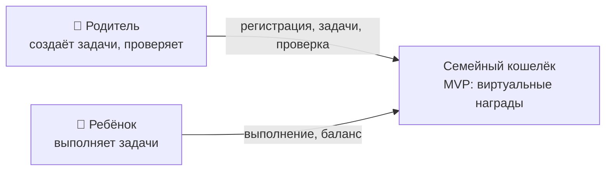
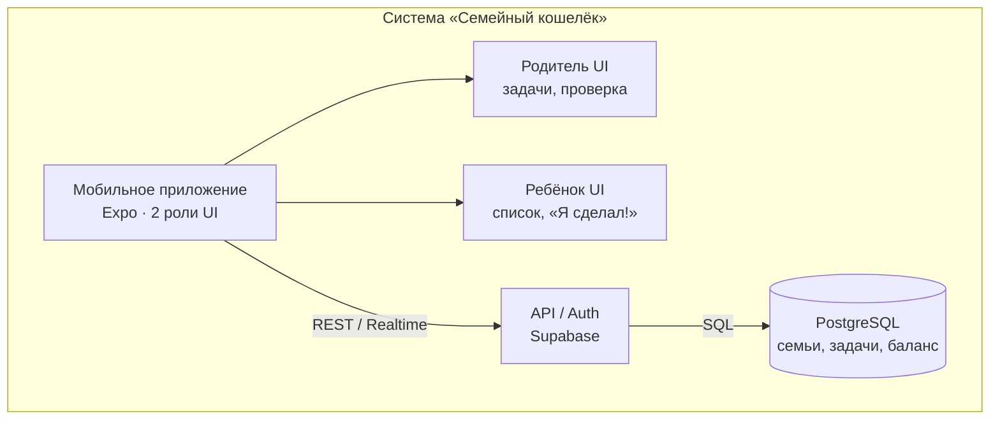
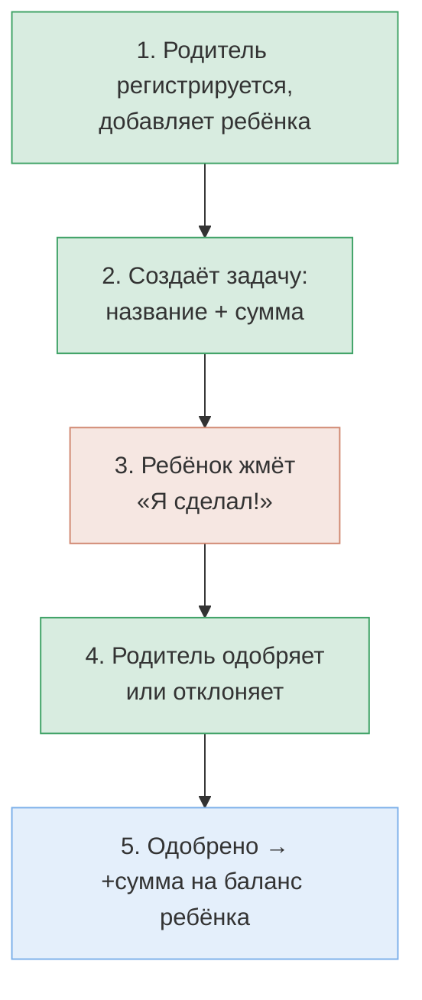
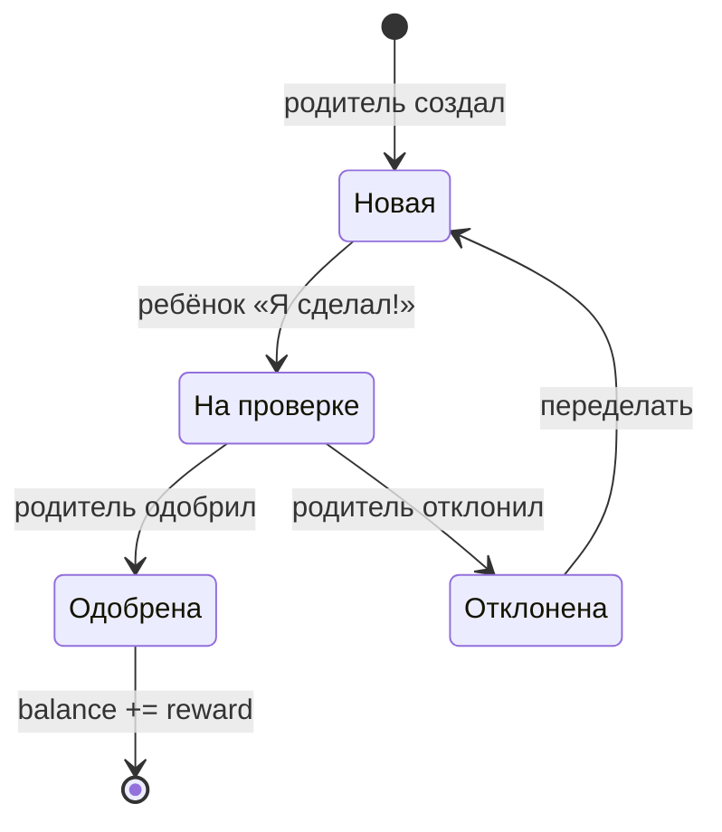

# C4 — Семейный кошелёк · MVP

Экспорт диаграмм для GitHub, Notion, Mermaid Live Editor.

---

## Level 1 · System Context

---

## Level 2 · Containers

---

## Бизнес-процесс · 5 шагов

---

## Жизненный цикл задачи

---

## Модель данных (MVP)

| Сущность | Описание | Ключевые поля |
|----------|----------|---------------|
| Family | семья | name, invite_code |
| User | пользователь | role: parent\|child, name, balance |
| Task | задача | title, reward, status, assigned_to |
| Transaction | операция | amount, type: earn, task_id |

---

## Бизнес-правила

1. Деньги **виртуальные** — реальная выплата вне приложения
2. Баланс меняется **только** после одобрения родителем
3. Отклонённая задача возвращается ребёнку на доработку
4. Один родитель + 1–3 ребёнка в MVP

---

## Шаг 1 · детализация

### 1a. Регистрация родителя
1. Email + пароль
2. Имя родителя
3. Создаётся Family
4. role = parent

### 1b. Добавление ребёнка
1. Имя + возраст
2. role = child
3. balance = 0
4. Привязка к Family

### 1c. Результат
1. Family с 1+ детьми
2. Семейный код для входа ребёнка
3. Готов к шагу 2
